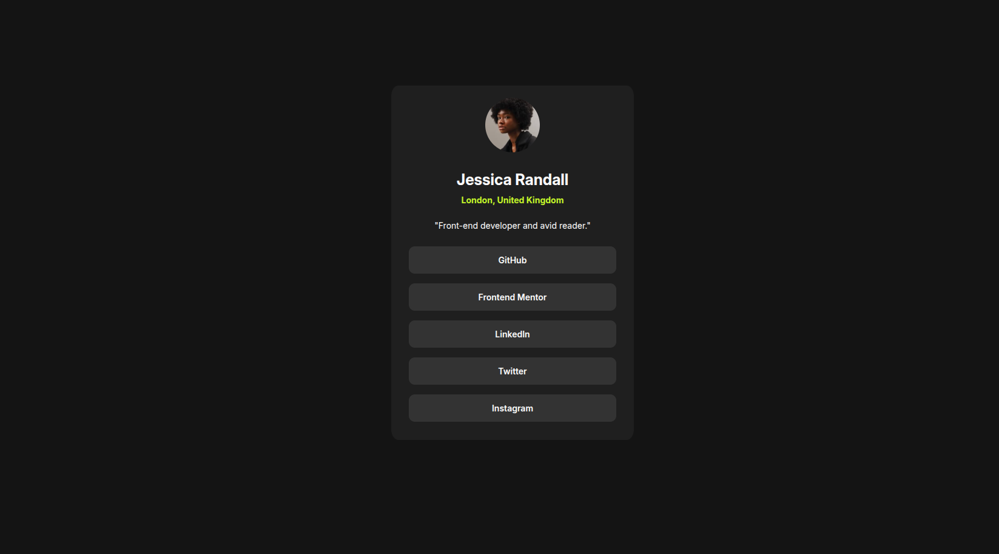
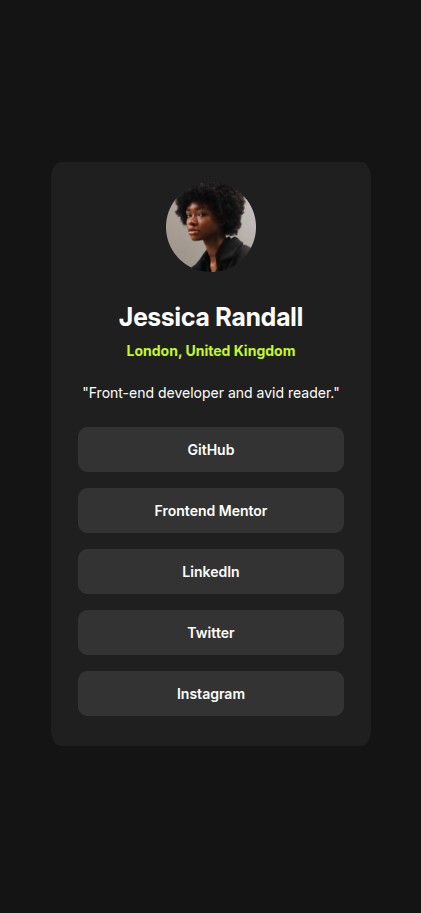

# Frontend Mentor - Social links profile solution

### Screenshot

### Links

- Solution URL: [solution URL](https://github.com/ob-codes/social-links-profile-main)
- Live Site URL: [live site URL](https://ob-codes.github.io/social-links-profile-main/)

### Built with

- Semantic HTML5 markup
- CSS custom properties
- Flexbox
- Mobile-first workflow

### What I learned
Initially, I thought border radius was only set with percentages but I learnt in this tutorial that there are other units that can be used as well.

## Author

- Quartey Obed Nii Kpakpa
- Frontend Mentor - [@obkpakpa](https://www.frontendmentor.io/profile/obkpakpa)